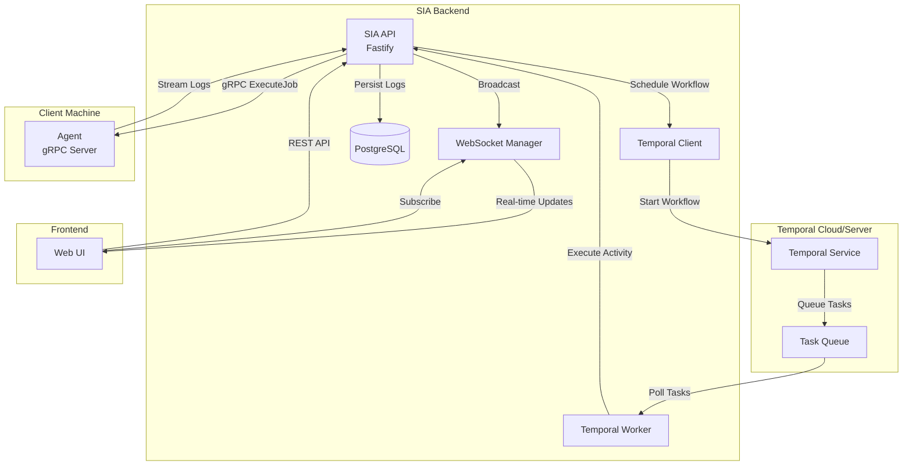
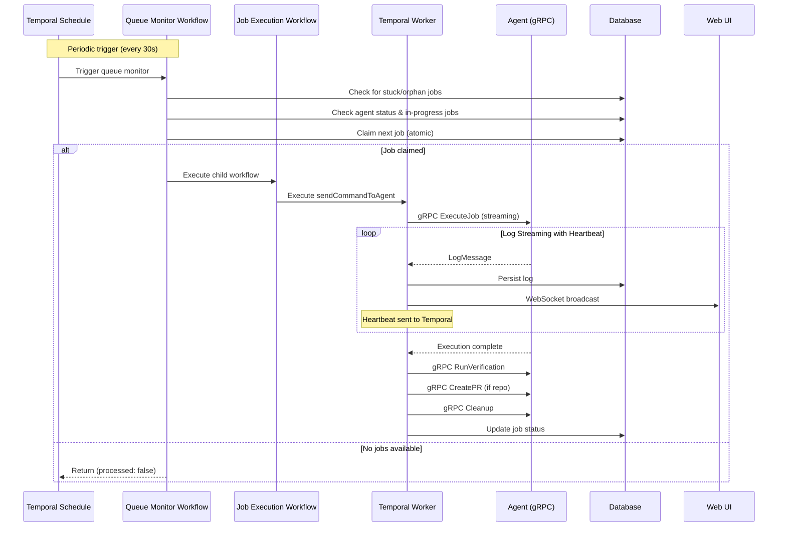
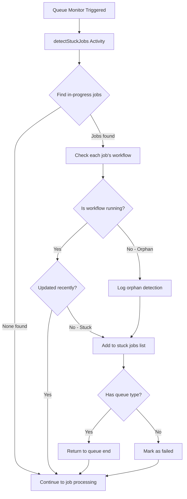
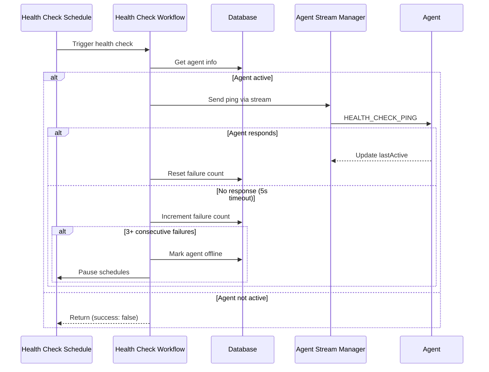
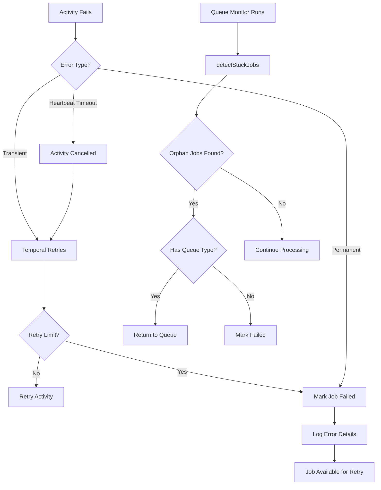

# Design Document: Temporal Task Queue

## Overview

This design document describes the architecture for integrating Temporal.io as the task queue orchestration layer for the SIA platform. The system enables durable, fault-tolerant task execution where tasks are scheduled sequentially by priority, executed by Agents on client machines via gRPC, and monitored in real-time.

The key architectural decision is to use Temporal workflows to orchestrate task execution while leveraging the existing gRPC-based Agent communication. Temporal provides durability, automatic retries, and workflow state management, while the Agent continues to perform actual task execution on client machines.

The system incorporates robust resilience patterns:

- **Heartbeat Monitoring**: Activities are configured with heartbeat timeouts to detect unresponsive agents
- **Orphan Job Detection**: Periodic checks identify jobs whose workflows have crashed or terminated unexpectedly
- **Automatic Recovery**: Orphan and stuck jobs are automatically returned to the queue for retry
- **Agent Health Checks**: Continuous monitoring of agent availability with automatic offline detection

## Architecture



### Workflow Execution Flow



### Simplified Queue Monitor Flow

The queue monitor workflow has been simplified to use only 2 activities:

```
┌─────────────────────────────────────────────────────────────────┐
│                    Temporal Schedule (Every 1 min)              │
│                    queue-schedule-{agentId}                     │
└────────────────────────────┬────────────────────────────────────┘
                             │
                             ▼
┌─────────────────────────────────────────────────────────────────┐
│              Queue Monitor Workflow Triggered                   │
│                  (Single Workflow)                              │
└────────────────────────────┬────────────────────────────────────┘
                             │
                             ▼
                    ┌────────────────┐
                    │ preprocessActivity│
                    │ - Check orphans │
                    │ - Heartbeat if  │
                    │   job in progress│
                    │ - Get next job  │
                    └────────┬────────┘
                             │
                    ┌────────┴────────┐
                    │                 │
                Job Found          No Job
                    │                 │
                    ▼                 ▼
         ┌──────────────────┐  ┌──────────┐
         │ executeChild     │  │  Exit    │
         │ (Job Execution)  │  └──────────┘
         └──────────────────┘
```

### Agent Reconnect Flow

```
┌─────────────────────────────────────────────────────────────────┐
│              User Clicks "Reconnect" in UI                      │
└────────────────────────────┬────────────────────────────────────┘
                             │
                             ▼
┌─────────────────────────────────────────────────────────────────┐
│         POST /agents/:id/reconnect API Called                   │
└────────────────────────────┬────────────────────────────────────┘
                             │
                             ▼
                    ┌────────────────┐
                    │  Ping Agent    │
                    │  via gRPC      │
                    └────────┬────────┘
                             │
                    ┌────────┴────────┐
                    │                 │
              Ping Success       Ping Failed
                    │                 │
                    ▼                 ▼
         ┌──────────────────┐  ┌──────────────────┐
         │ Set status=active│  │ Return Error     │
         │ Reset failures=0 │  │ Agent stays      │
         │ Update lastActive│  │ offline          │
         └────────┬─────────┘  └──────────────────┘
                  │
                  ▼
         ┌──────────────────┐
         │ Resume Temporal  │
         │ Schedule         │
         └────────┬─────────┘
                  │
                  ▼
         ┌──────────────────┐
         │ Return Success   │
         │ Agent is back    │
         │ online           │
         └──────────────────┘
```

### Agent Registration Flow (gRPC)

```
┌─────────────────────────────────────────────────────────────────┐
│           Agent Connects via gRPC (RegisterAgent)               │
└────────────────────────────┬────────────────────────────────────┘
                             │
                             ▼
                    ┌────────────────┐
                    │ Validate API   │
                    │ Key            │
                    └────────┬────────┘
                             │
                    ┌────────┴────────┐
                    │                 │
              Agent Exists      New Agent
                    │                 │
                    ▼                 ▼
         ┌──────────────────┐  ┌──────────────────┐
         │ Update Agent     │  │ Create Agent     │
         │ status=active    │  │ status=active    │
         │ Reset failures=0 │  │ failures=0       │
         └────────┬─────────┘  └────────┬─────────┘
                  │                     │
                  └──────────┬──────────┘
                             │
                             ▼
                    ┌────────────────┐
                    │ Was Previously │
                    │ Inactive?      │
                    └────────┬────────┘
                             │
                    ┌────────┴────────┐
                    │                 │
                   YES               NO
                    │                 │
                    ▼                 ▼
         ┌──────────────────┐  ┌──────────┐
         │ Start/Resume     │  │ Schedule │
         │ Temporal Schedule│  │ Already  │
         └──────────────────┘  │ Running  │
                               └──────────┘
```

### Orphan Job Detection Flow



### Agent Health Check Flow



## Components and Interfaces

### 1. Temporal Client Service

Responsible for interacting with the Temporal service to start workflows and query workflow state.

```typescript
// apps/api/src/temporal/client.ts
interface TemporalClientService {
  /**
   * Starts a task execution workflow for a queued job
   */
  startTaskWorkflow(params: {
    jobId: string;
    orgId: string;
    orderInQueue: number;
  }): Promise<{ workflowId: string; runId: string }>;

  /**
   * Signals a running workflow to cancel
   */
  cancelWorkflow(workflowId: string): Promise<void>;

  /**
   * Queries the current state of a workflow
   */
  getWorkflowStatus(workflowId: string): Promise<WorkflowStatus>;

  /**
   * Gets the Temporal client instance
   */
  getClient(): WorkflowClient;
}

interface WorkflowStatus {
  status: 'RUNNING' | 'COMPLETED' | 'FAILED' | 'CANCELLED' | 'TERMINATED';
  startTime: Date;
  closeTime?: Date;
  currentTaskId?: string;
}
```

### 2. Queue Monitor Workflow

A short-lived workflow triggered by Temporal Schedules that checks for available jobs and processes them.

```typescript
// apps/api/src/temporal/workflows/queue-monitor-workflow.ts
interface QueueMonitorWorkflowInput {
  agentId: string;
}

interface QueueMonitorWorkflowOutput {
  processed: boolean;
  jobId?: string;
  queueType?: 'rework' | 'backlog';
}

// Workflow checks both queues in priority order (rework first)
// Atomically claims jobs to prevent race conditions
async function queueMonitorWorkflow(
  input: QueueMonitorWorkflowInput
): Promise<QueueMonitorWorkflowOutput>;
```

### 3. Job Execution Workflow

The Temporal workflow that orchestrates the execution of a single job.

```typescript
// apps/api/src/temporal/workflows/job-execution-workflow.ts
interface JobExecutionWorkflowInput {
  jobId: string;
  orgId: string;
  queueType: 'rework' | 'backlog';
  agentId?: string;
}

interface JobExecutionWorkflowOutput {
  prLink?: string;
  status: string;
}

// Workflow executes: get credentials -> execute job -> verify -> create PR -> cleanup
async function jobExecutionWorkflow(
  input: JobExecutionWorkflowInput
): Promise<JobExecutionWorkflowOutput>;
```

### 4. Agent Health Check Workflow

A workflow that verifies agent availability via stream-based ping.

```typescript
// apps/api/src/temporal/workflows/agent-health-check-workflow.ts
interface AgentHealthCheckWorkflowInput {
  agentId: string;
}

interface AgentHealthCheckWorkflowOutput {
  success: boolean;
}

// Workflow pings agent and tracks consecutive failures
// Marks agent offline after 3 consecutive failures
async function agentHealthCheckWorkflow(
  input: AgentHealthCheckWorkflowInput
): Promise<AgentHealthCheckWorkflowOutput>;
```

### 5. Temporal Activities

Activities that perform the actual work, including gRPC calls to the Agent and resilience operations.

```typescript
// apps/api/src/temporal/activities/

// Send commands to agent via gRPC
interface SendCommandToAgentActivity {
  sendCommandToAgent(params: {
    jobId: string;
    orgId: string;
    command:
      | 'startExecution'
      | 'waitForCompletion'
      | 'runVerification'
      | 'createPR'
      | 'cleanup';
    payload?: any;
  }): Promise<any>;
}

// Detect and handle stuck/orphan jobs
interface DetectStuckJobsActivity {
  detectStuckJobs(params: {
    orgId: string;
    stuckThresholdMinutes?: number; // Default: 60
  }): Promise<{ detected: number; handled: number; orphanJobs: number }>;
}

// Atomically claim next job from queue
interface ClaimNextJobActivity {
  claimNextJobFromQueue(params: {
    orgId: string;
    queueType: 'rework' | 'backlog';
  }): Promise<{ jobId: string; orderInQueue: number } | null>;
}

// Agent health check via stream
interface PingAgentActivity {
  pingAgentViaStream(params: {
    agentId: string;
  }): Promise<{ success: boolean; error?: string }>;
}

// Update agent status
interface UpdateAgentStatusActivity {
  updateAgentStatus(params: {
    agentId: string;
    status?: 'active' | 'offline';
    consecutiveFailures?: number;
  }): Promise<void>;
}

// Pause agent schedules when offline
interface PauseAgentSchedulesActivity {
  pauseAgentSchedules(params: { agentId: string }): Promise<void>;
  pauseHealthCheckSchedule(params: { agentId: string }): Promise<void>;
}

// Update job status
interface UpdateJobStatusActivity {
  updateJobStatus(params: {
    jobId: string;
    orgId: string;
    status: JobStatus;
    prLink?: string;
    error?: string;
  }): Promise<void>;
}

// Log to job activity
interface LogToJobActivity {
  logToJobActivity(params: {
    jobId: string;
    orgId: string;
    level: 'info' | 'error' | 'warn';
    message: string;
    stage: string;
  }): Promise<void>;
}
```

### 6. Temporal Worker

The worker process that polls Temporal for tasks and executes workflows/activities.

```typescript
// apps/api/src/temporal/worker.ts
interface TemporalWorkerConfig {
  taskQueue: 'job-queue';
  namespace: string;
  maxConcurrentActivityTaskExecutions: 1; // Sequential execution
}

// Worker configuration includes bundler options to ignore
// activity-only modules in workflow context
const bundlerOptions = {
  ignoreModules: [
    '@temporalio/client',
    'events',
    'net',
    'dns',
    'tls',
    'crypto',
    'path',
    'fs',
    'stream',
    'string_decoder',
    'pg-native',
  ],
};
```

### 7. Queue Management Activities

Activities for managing queue state and job claiming.

```typescript
// apps/api/src/temporal/activities/queue-management-activity.ts
interface QueueManagementActivities {
  /**
   * Removes a job from the queue after claiming
   */
  removeJobFromQueue(params: {
    jobId: string;
    orgId: string;
    queueType: 'rework' | 'backlog';
    orderInQueue: number;
  }): Promise<void>;

  /**
   * Reprioritizes remaining jobs after removal
   */
  reprioritizeQueueAfterRemoval(params: {
    orgId: string;
    queueType: 'rework' | 'backlog';
    removedPosition: number;
  }): Promise<void>;
}

// apps/api/src/temporal/activities/queue-status-activity.ts
interface QueueStatusActivities {
  /**
   * Checks if queue is paused for an organization
   */
  isQueuePaused(params: {
    orgId: string;
    queueType: 'rework' | 'backlog';
  }): Promise<boolean>;

  /**
   * Gets agent information
   */
  getAgent(params: { agentId: string }): Promise<Agent | null>;

  /**
   * Checks if agent has a job in progress
   */
  hasAgentInProgressJob(params: {
    agentId: string;
    queueType: 'rework' | 'backlog';
  }): Promise<boolean>;
}
```

### 8. Agent Client Service

gRPC client for communicating with agents.

```typescript
// apps/api/src/services/agent-client.ts
interface AgentClient {
  /**
   * Executes a job on the agent with streaming logs
   */
  executeJob(options: {
    jobId: string;
    prompt: string;
    repoId?: string;
    jobDetails?: Record<string, string>;
    onLog?: (log: LogMessage) => void;
  }): Promise<void>;

  /**
   * Runs verification on the agent
   */
  runVerification(jobId: string): Promise<VerificationResponse>;

  /**
   * Creates a PR via the agent
   */
  createPR(params: {
    jobId: string;
    repoId: string;
    branchName: string;
    title: string;
    body: string;
  }): Promise<PRResponse>;

  /**
   * Cleans up workspace on the agent
   */
  cleanupWorkspace(jobId: string): Promise<CleanupResponse>;

  /**
   * Cancels a running job
   */
  cancelJob(jobId: string): Promise<CancelJobResponse>;
}
```

## Data Models

### Database Schema Updates

```typescript
// Addition to existing jobs table - new column
interface JobTemporalFields {
  temporalWorkflowId: string | null; // Temporal workflow ID
  temporalRunId: string | null; // Temporal run ID
}

// New table for tracking queue execution state
interface QueueExecutionState {
  id: string;
  orgId: string;
  currentJobId: string | null;
  workflowId: string | null;
  lastProcessedAt: Date;
  createdAt: Date;
  updatedAt: Date;
}
```

### Temporal Workflow State

```typescript
interface WorkflowState {
  currentTaskId: string | null;
  completedTasks: string[];
  failedTasks: string[];
  isCancelled: boolean;
  startTime: Date;
  lastActivityTime: Date;
}
```

## Correctness Properties

_A property is a characteristic or behavior that should hold true across all valid executions of a system-essentially, a formal statement about what the system should do. Properties serve as the bridge between human-readable specifications and machine-verifiable correctness guarantees._

### Property 1: Workflow Creation Round-Trip

_For any_ job that transitions to 'queued' status, if workflow creation succeeds, then the job record SHALL contain a valid Temporal workflow ID.
**Validates: Requirements 1.1, 1.4**

### Property 2: Workflow Parameters Completeness

_For any_ Temporal workflow creation, the workflow input SHALL contain a valid jobId, orgId, and orderInQueue value.
**Validates: Requirements 1.2**

### Property 3: Sequential Execution Order

_For any_ set of queued tasks for an organization, tasks SHALL execute in ascending `orderInQueue` order, meaning a task with orderInQueue N completes before a task with orderInQueue M starts (where N < M).
**Validates: Requirements 2.1**

### Property 4: Queue Continuation After Completion

_For any_ task that completes (success, failure, or cancellation), if there are remaining queued tasks for the organization, the next task in queue order SHALL be triggered for execution.
**Validates: Requirements 2.2, 5.4, 6.4**

### Property 5: Single Execution Per Organization

_For any_ organization at any point in time, at most one task SHALL be in 'in-progress' status.
**Validates: Requirements 2.4**

### Property 6: Non-Preemptive Queuing

_For any_ new task added while another task is executing for the same organization, the new task SHALL be queued and not interrupt the executing task.
**Validates: Requirements 2.3**

### Property 7: gRPC Activity Invocation

_For any_ task execution activity, the activity SHALL invoke the Agent's ExecuteJob gRPC method with the correct jobId and prompt.
**Validates: Requirements 3.1**

### Property 8: Activity Result Propagation

_For any_ completed Agent execution, the activity SHALL return the execution result (success/failure and logs) to the workflow.
**Validates: Requirements 3.3**

### Property 9: Log Streaming Persistence

_For any_ log message streamed from the Agent during execution, the log SHALL be persisted to the database with the correct jobId and timestamp.
**Validates: Requirements 4.1, 5.3**

### Property 10: Log Streaming Broadcast

_For any_ log message streamed from the Agent, if there are WebSocket subscribers for that job, the log SHALL be broadcast to all subscribers.
**Validates: Requirements 4.2**

### Property 11: Stage Change Events

_For any_ task stage transition, a stage-change event SHALL be emitted to subscribers containing the new stage name.
**Validates: Requirements 4.4**

### Property 12: Failure Status Update

_For any_ task that fails after exhausting retries, the job status SHALL be updated to 'failed'.
**Validates: Requirements 5.2**

### Property 13: Cancellation Signal Propagation

_For any_ cancellation request, the system SHALL signal the Temporal workflow to cancel.
**Validates: Requirements 6.1**

### Property 14: Cancellation gRPC Invocation

_For any_ workflow that receives a cancellation signal, the workflow SHALL invoke the Agent's CancelJob gRPC method.
**Validates: Requirements 6.2**

### Property 15: Cancellation Status Update

_For any_ cancelled task, the job status SHALL be updated to 'failed' with a cancellation indicator.
**Validates: Requirements 6.3**

### Property 16: Queue Status Completeness

_For any_ queue status request, the response SHALL include all queued tasks with their positions, priorities, and the currently executing task if one exists.
**Validates: Requirements 8.1, 8.3**

### Property 17: Workflow Status Query

_For any_ workflow status request, the system SHALL query Temporal and return the current workflow execution state.
**Validates: Requirements 8.2**

### Property 18: Heartbeat Timeout Configuration

_For any_ job execution activity, the activity SHALL be configured with a heartbeat timeout of 5 minutes.
**Validates: Requirements 9.1, 9.4**

### Property 19: Orphan Job Detection

_For any_ job in 'in-progress' status, if the associated Temporal workflow is not running, the system SHALL identify it as an orphan job.
**Validates: Requirements 10.1, 10.2**

### Property 20: Orphan Job Queue Recovery

_For any_ orphan job with a queue type, the system SHALL return the job to the end of its original queue with the next available position.
**Validates: Requirements 10.3, 10.5**

### Property 21: Orphan Job Failure Marking

_For any_ orphan job without a queue type, the system SHALL mark the job as 'failed'.
**Validates: Requirements 10.4**

### Property 22: Stuck Job Detection

_For any_ job in 'in-progress' status that has not been updated within the stuck threshold (default 60 minutes), the system SHALL consider it stuck.
**Validates: Requirements 11.1, 11.2**

### Property 23: Agent Health Check Ping

_For any_ active agent, when a health check is triggered, the system SHALL send a ping message via the agent's stream connection.
**Validates: Requirements 12.1**

### Property 24: Agent Health Check Success

_For any_ agent that responds to a health check ping, the system SHALL reset the agent's consecutive failure count to zero.
**Validates: Requirements 12.2**

### Property 25: Agent Health Check Failure Tracking

_For any_ agent that fails to respond to a health check, the system SHALL increment the agent's consecutive failure count.
**Validates: Requirements 12.3**

### Property 26: Agent Offline Detection

_For any_ agent with three or more consecutive health check failures, the system SHALL mark the agent as 'offline'.
**Validates: Requirements 12.4**

### Property 27: Agent Schedule Pausing

_For any_ agent marked as offline, the system SHALL pause the agent's queue monitoring and health check schedules.
**Validates: Requirements 12.5**

### Property 28: Atomic Job Claiming

_For any_ job claim operation, the system SHALL atomically remove the job from the queue and mark it as 'in-progress' to prevent race conditions.
**Validates: Requirements 13.2, 13.3**

### Property 29: Queue Priority Order

_For any_ queue monitor execution, the system SHALL check the rework queue before the backlog queue.
**Validates: Requirements 13.4**

### Property 30: Single Job Per Agent

_For any_ agent with a job already in progress, the queue monitor SHALL skip processing for that agent.
**Validates: Requirements 13.5**

## Error Handling

### Temporal Activity Retry Policy

```typescript
// Job execution activities (long-running)
const jobExecutionActivityOptions = {
  startToCloseTimeout: '30 minutes',
  heartbeatTimeout: '5 minutes', // Detect unresponsive agents
  retry: {
    initialInterval: '1s',
    maximumInterval: '30s',
    maximumAttempts: 3,
  },
};

// Queue management activities (short-lived)
const queueActivityOptions = {
  startToCloseTimeout: '1 minute',
  retry: {
    initialInterval: '1s',
    maximumAttempts: 3,
  },
};

// Health check activities (very short)
const healthCheckActivityOptions = {
  startToCloseTimeout: '15 seconds',
  retry: {
    initialInterval: '1s',
    maximumAttempts: 1, // No retries for health checks
  },
};
```

### Error Categories

1. **Transient Errors** (Retryable)

   - gRPC connection failures
   - Temporal service unavailability
   - Database connection issues

2. **Permanent Errors** (Non-Retryable)

   - Job not found
   - Agent not found
   - Invalid job state
   - Credentials failure

3. **Agent Errors**

   - Build failures (logged and job marked failed)
   - Execution timeouts (heartbeat timeout triggers retry)
   - Verification failures (job marked failed)

4. **Orphan/Stuck Job Errors**
   - Workflow crashed or terminated
   - Agent became unresponsive
   - Network partition

### Error Recovery Flow



### Workflow Error Handling

The job execution workflow includes comprehensive error handling:

1. **Error Message Extraction**: Extracts meaningful error messages from Temporal's wrapped ActivityFailure errors
2. **Detailed Logging**: Logs error message, cause, stack trace, and error type to job logs
3. **Status Update**: Updates job status to 'failed' with the extracted error message
4. **Cleanup**: Ensures workflow completion is logged even on failure (via finally block)

## Testing Strategy

### Property-Based Testing

The system will use **fast-check** as the property-based testing library for TypeScript/JavaScript.

Each property-based test MUST:

- Be annotated with the format: `**Feature: temporal-task-queue, Property {number}: {property_text}**`
- Run a minimum of 100 iterations
- Use smart generators that constrain inputs to valid states

### Unit Tests

Unit tests will cover:

- Temporal client service methods
- Activity implementations
- Queue management service
- Workflow logic (using Temporal's testing utilities)

### Integration Tests

Integration tests will verify:

- End-to-end workflow execution
- gRPC communication with mock Agent
- Database state transitions
- WebSocket event broadcasting

### Test Infrastructure

```typescript
// Test utilities for Temporal
import { TestWorkflowEnvironment } from '@temporalio/testing';
import { Worker } from '@temporalio/worker';

// Property testing with fast-check
import * as fc from 'fast-check';
```
